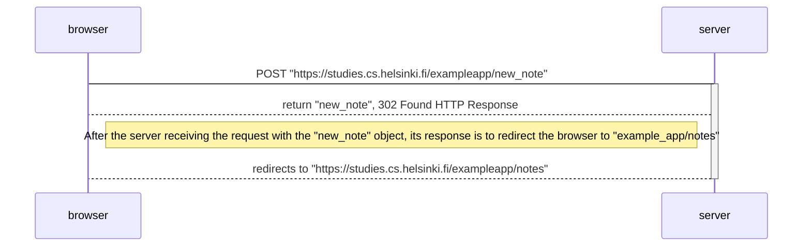

```mermaid
sequenceDiagram
    
    participant browser
    participant server

    browser->server: POST "https://studies.cs.helsinki.fi/exampleapp/new_note"
    activate server
    server-->browser: return "new_note", 302 Found HTTP Response
    note right of browser: After the server receiving the request with the "new_note" object, its response is to redirect the browser to "example_app/notes"
    server-->browser: redirects to "https://studies.cs.helsinki.fi/exampleapp/notes"
    deactivate server
```
